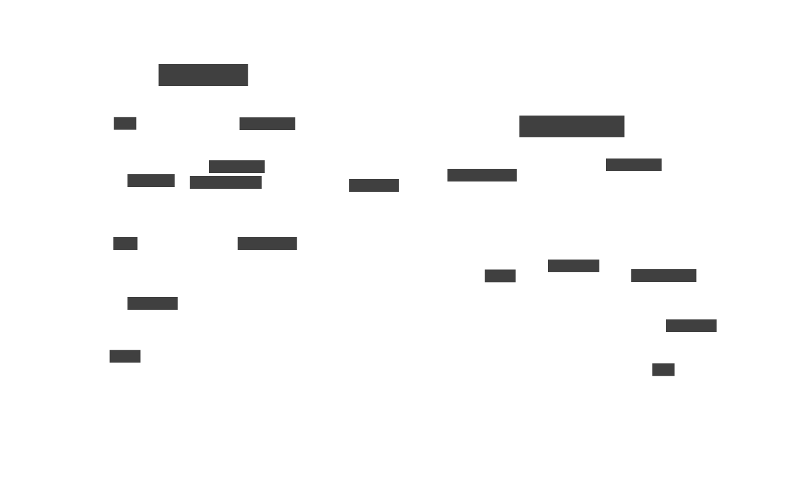

# The Open Intents Framework (OIF): Permissionless Cross-chain Intents

⚠️ **SECURITY WARNING** ⚠️

This project is currently using an **unaudited version** of OpenZeppelin Contracts instead of the latest released audited version. **Before any production release, it is mandatory to update to the latest audited version** to ensure security and stability.

---

The OIF is a full-stack developer framework that allows cross-chain intents to permissionlessly be deployed, solved, and discovered. Its comprised of two main pieces:
- Smart contracts (this repo)
- [Open-source solver](https://github.com/openintentsframework/oif-solvers)

At a high-level, the OIF is a modular, intent-based cross-chain swap protocol. Users sign customizable intents describing the desired assets, delivery, validation, execution, etc., which can be permissionlessly filled and delivered by solvers.

The goal of the OIF is to provide a base implementation that can be permissionlessly expanded while providing a foundation for more expressible intents that can be composed with OIF deployments.

OIF is built with output-input separation. The goal is to fully separate the various system components and support different mechanisms of asset collection. Specifically, both Output First and Input Second flows are facilitated by [Resource Locks](https://docs.onebalance.io/concepts/resource-locks) and traditional escrows in a single system. 

To achieve this, the system has been modularised:
- **InputSettler**: Input collection contract on the input chain. Serves multiple proposes, but the main one is to finalise intents. This contracts is responsible for validating that the intents was filled on the validation chain(using the oracle) and unlocking input contracts to the filler.
- **OutputSettler**: Output delivery contract on the output chain. Allows solvers to fill outputs of orders.
- **Oracle**: Proof layer. Generally a messaging protocol but can be anything: Optimistic proofs, light clients, storage proofs, off-chain agent, etc. Generates proof of filled outputs.

### System Diagram

Refer to the SVG diagram chart.

### Dictionary 

- Lock: An escrow that provides system participants a claim to asset if a given action is performed. A lock can be a simple escrow implementation or more complicated like a resource lock.
- Intent: A description of a desired state change. Within the OIF, the state change is likely to be an asset swap (input for output) but could also be some logic execution (gas sponsoring).
- Inputs: The assets to be released from a lock after the Outputs have been proven delivered. Will be paid by the sponsor of an order.
- Input Chain: The chain where the input assets originate from. There may be multiple input chains.
- Output Chain: The chain where the output assets are paid on. There may be multiple output chains.
- User: The end user of the protocol. Is the sponsor in most cases.
- Outputs: The assets that have to be paid to be able to collect inputs from an order. 
- Solver: An external entity that facilitates swaps for users. Is the filler in most cases.
- Sponsor: The provider of the input assets on the input chain. Will receive their desired assets (output) first, and pay (inputs) second.
- Filler (Actor): The provider of assets on the output chain and executors of swaps. Will pay (outputs) first, and get their assets (inputs) second.

## InputSettler

Input Settlers are located in `src/input`. Currently, 2 Settlers are implemented:
- `src/input/compact/InputSettlerCompact.sol`
- `src/input/escrow/InputSettlerEscrow.sol`

To implement a new lock or a different order type, the following considerations are required to make it compatible with the rest of the system:
- **OutputSettler**: To be compatible with the `MandateOutput` OutputSettlers, implement `MandateOutput` described in `src/input/types/MandateOutputType.sol` using the encoding scheme from `src/libs/MandateOutputEncodingLib.sol`.
- **Oracle**: To be compatible with OIF oracles, implement a validation function that calls either of the `IInputOracle` functions from `src/interfaces/IInputOracle.sol`.

Assuming the Settler supports both these structures, it is now compatible with the existing solvers and fillers.

### Selection of solver

If an order contains multiple outputs, the **selected** solver will be the one filling the first output. That means:
- If multiple solvers fill different outputs, only the first solver gets to decide who gets paid.
- A filler may fill the first output but not the remaining. This effectively stops other solvers from filling the remaining order; For intent issuers: Always make the first output the most expensive.
- Output 1 may be solved first while the remaining outputs may first be filled later.
- Dutch auctions only work on the first output.
- All Outputs may be solved atomically but in a random order. You cannot compose multiple assets into a single output call; You cannot know in which order the outputs will be filled in.

### Security Considerations: First Solver Ownership

**Important**: The solver filling the first output becomes the order owner and can claim funds after settlement. This creates specific risks for multi-output orders:

**For Users:**
- **DoS Risk**: First solver may refuse to fill remaining outputs, delaying execution until expiry
  - *Mitigation*: Make the first output the most valuable
- **Price Manipulation**: First solver can delay other outputs, potentially worsening prices
  - *Mitigation*: Avoid time-based mechanisms (e.g., Dutch auctions) on non-first outputs

**For Solvers:**
- **Completion Risk**: Must fill ALL outputs before `fillDeadline` and prove completion before `expiry`
- **Callback Risk**: Arbitrary code execution during output filling may revert transactions
  - *Mitigation*: Refuse orders with callbacks outside of the primary batch (that containing the first output) unless it's known that it can't possibly revert (considering that a successful off-chain simulation is not a guarantee of on-chain success)

###  Order Purchasing / Underwriting

The OIF supports underwriting. Within the contracts, this is described as order purchasing. Underwriting serves 2 purposes:
1. To speed up solver capital rotation by borrowing assets from less risk-adverse solvers.
2. In case of the user acting as the solver, they can receive their assets faster providing an expedited and better user experience.

When implementing a new Settler, you may inherit `src/input/InputSettlerPurchase.sol` to facilitate order purchasing.

### Inputs vs Outputs

Orders have 2 lists of tokens – Inputs and Outputs – to describe which assets (inputs) the sponsor is offering and which assets the filler should provide in exchange (outputs).
The InputSettler always sits on the input chain together with the input tokens.
In a normally operating implementation, the user is the sponsor providing the inputs and the solver is the filler providing the outputs. Input is never proven and is always assumed to exist.

#### Supporting any chain through User as filler. 

The OIF framework only sends directional proofs: Oracles only validate outputs. That means there exist limitations for which chains can be output chains. To improve chain support, the system supports a secondary flow where solvers issue intents and users fill the intents.

An ordinary swap works by the solver filling outputs on the output chain and then validating the generated proof on the input chain to collect the inputs. This requires that the output chain can generate proofs / is supported by the messaging protocol. However, it does not require that the input chain is supported. Only that the validation logic exists on that chain.
This means that the system supports directional swaps if the output chain supports proof generation.

To make the swap support bi-directionally, the system supports a secondary flow where the user becomes the filler and the Solver becomes the sponsor. That means the user provides the assets on chain A while getting assets on chain B; A swap from chain A to chain B.
This scheme allows The OIF to scale to any chain where only one of the chains has a working messaging protocol – This includes chains like Bitcoins where settlement proofs can be sent from Bitcoin to other chains but not the other way around.

#### ChainIds

ChainIds should typically follow the "canonical" chain id: `block.chainid`. While the output chainId is defined by the inputOracle, it is good practice to implement it as the remote chain's `block.chainid` or equivalent.

## Output Settler

The Output Settler contract sits on the output chain and allows filling outputs. It is expected that Output Settler implementations expose whether a payload is valid by implementing the `IPayloadValidator` interface and exposing the `.hasAttested()` view function. Notice that the requirement that the Output Settler asserts payloads means that the Output Settler and Input Settler need to form the same payloads to properly validate that outputs have been filled.

Otherwise, the fill interface is left undefined. It is generally expected that the filler takes outputs as `MandateOutput`.

## Oracle

Oracles are located in `src/integrations/oracles`. `src/oracles/BaseInputOracle.sol` provides a standardized attestation storage structure along with attestation lookup structures. This allows anyone to easily create new oracles that remains compatible with Input Settlers.

Message submission and/or relaying is not defined and has to be created specifically for each oracle. The most important compatibility layer between fillers and oracles exists through the `IAttester.hasAttested`.

# Contributions

The Open Intents Framework is open for anyone to contribute!

### Build

```shell
forge build [--sizes]
```

### Test

```shell
forge test
```

### Coverage

```shell
forge coverage --no-match-coverage "(script|test|integrations/oracles/.*/external)" [--report lcov]
```